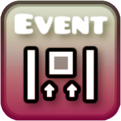

# Trigger <cr>V</c><co>i</c><cy>s</c><cg>u</c><cj>a</c><cl>l</c><cb>i</c><cp>z</c><cr>e</c><co>r</c>

## About
Trigger Visualizer replaces default trigger textures with clearer visuals that **represent trigger behavior directly in the editor**

Instead of generic icons, triggers now visually indicate **what they do**, making complex setups easier to understand at a glance

The mod also supports **dynamic textures**, meaning some triggers **change their appearance based on their settings**
This allows you to see key parameters without opening the edit menu

The mod also includes **Old Color trigger sprites support**, improving compatibility with older levels

---

## Additionally
- **104 trigger types modified**
- **245 custom textures included**
- **24 triggers support dynamic textures**

---

## Notes
- Affects **editor visuals only**
- Does **not** change gameplay
- Designed for better clarity, faster building, and easier debugging